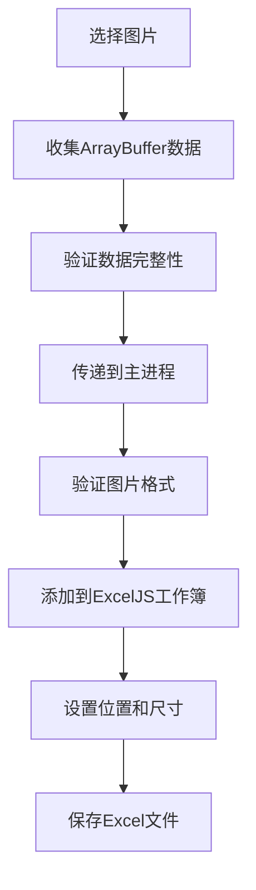

# Excel图片嵌入修复指南

## 修复概述

本次修复解决了Excel导出文件中图片无法正常显示的问题。主要修复内容包括：

### 1. 图片定位参数修正
- **问题**: ExcelJS的图片定位参数使用错误，导致图片位置不正确
- **修复**: 使用正确的`tl`（左上角）和`ext`（尺寸）参数
- **位置**: `src/main.ts` 第869-874行

```typescript
// 修复前（错误的定位方式）
worksheet.addImage(imageId, {
  tl: { col: 1, row: i + 1 },
  ext: { width: 150, height: 100 },
  editAs: 'oneCell'
});

// 修复后（正确的定位方式）
worksheet.addImage(imageId, {
  tl: { col: 1.05, row: rowIndex - 0.95 },
  ext: { width: 140, height: 90 },
  editAs: 'oneCell'
});
```

### 2. 图片数据验证增强
- **问题**: 缺少对图片数据有效性的验证
- **修复**: 添加图片文件头验证函数
- **位置**: `src/main.ts` 第1037-1058行

```typescript
function validateImageBuffer(buffer: Buffer, extension: string): boolean {
  // 检查JPEG、PNG、GIF等格式的文件头魔数
  // 确保图片数据完整有效
}
```

### 3. 图片数据收集优化
- **问题**: 图片数据在传递过程中可能丢失或损坏
- **修复**: 优化数据收集流程，增加多重验证
- **位置**: `src/utils/imageDataCollector.ts`

```typescript
// 按优先级尝试多种收集方法：
// 1. 直接从File对象获取（最可靠）
// 2. 从blob URL获取
// 3. 使用FileReader（备用方法）
```

### 4. 调试工具集成
- **新增**: 完整的调试工具，帮助诊断图片嵌入问题
- **位置**: `src/utils/excelImageDebugger.ts`
- **功能**: 
  - 记录每张图片的处理状态
  - 生成详细的调试报告
  - 提供故障排除建议

## 使用方法

### 1. 正常导出流程
1. 上传图片文件
2. 进行OCR识别（可选）
3. 点击"导出Excel"按钮
4. 选择保存位置
5. 查看控制台输出的调试信息

### 2. 查看调试信息
导出过程中，控制台会输出详细的调试信息：

```
📦 Using provided buffer for image: example.jpg, size: 123456 bytes
✅ Successfully embedded image: example.jpg at row 2 (source: provided buffer)

=== 📊 Excel图片嵌入调试摘要 ===
总图片数: 5
成功嵌入: 5
嵌入失败: 0
成功率: 100.0%
处理时间: 1234ms
```

### 3. 故障排除

如果图片仍然无法显示，请检查：

#### 3.1 图片格式支持
- ✅ 支持：JPEG (.jpg, .jpeg)、PNG (.png)、GIF (.gif)
- ✅ 部分支持：BMP (.bmp)、WebP (.webp) - 会转换为JPEG
- ❌ 不支持：SVG、TIFF等矢量格式

#### 3.2 文件大小限制
- 建议单个图片文件小于10MB
- 总导出文件建议小于50MB

#### 3.3 常见问题解决
1. **图片数据为空**
   - 重新选择图片文件
   - 确保图片文件未损坏

2. **嵌入失败**
   - 检查图片格式是否支持
   - 尝试压缩图片文件
   - 分批导出大量图片

3. **Excel文件过大**
   - 压缩图片质量
   - 减少单次导出的图片数量

## 技术细节

### 图片处理流程


### 关键修复点
1. **数据传递**: 确保ArrayBuffer数据在渲染进程和主进程间正确传递
2. **格式验证**: 通过文件头检查确保图片数据有效
3. **位置计算**: 使用正确的行列索引和偏移量
4. **错误处理**: 提供详细的错误信息和调试数据

## 测试建议

### 测试用例
1. **基本功能测试**
   - 单张图片导出
   - 多张图片导出
   - 不同格式图片混合导出

2. **边界条件测试**
   - 大尺寸图片（>5MB）
   - 大量图片（>20张）
   - 特殊文件名（中文、特殊字符）

3. **异常情况测试**
   - 损坏的图片文件
   - 不支持的格式
   - 网络中断情况

### 验证方法
1. 导出Excel文件后，用Excel软件打开
2. 检查图片是否正确显示在"图片预览"列
3. 验证图片尺寸和位置是否合适
4. 查看控制台调试信息确认处理状态

## 更新日志

### v1.1.0 (当前版本)
- ✅ 修复图片定位参数错误
- ✅ 增强图片数据验证
- ✅ 优化数据收集流程
- ✅ 集成调试工具
- ✅ 改进错误处理和日志

### 已知限制
- SVG格式图片需要转换为位图格式
- 超大图片可能影响Excel文件打开速度
- 某些版本的Excel可能对图片数量有限制

如有问题，请查看控制台调试信息或联系技术支持。